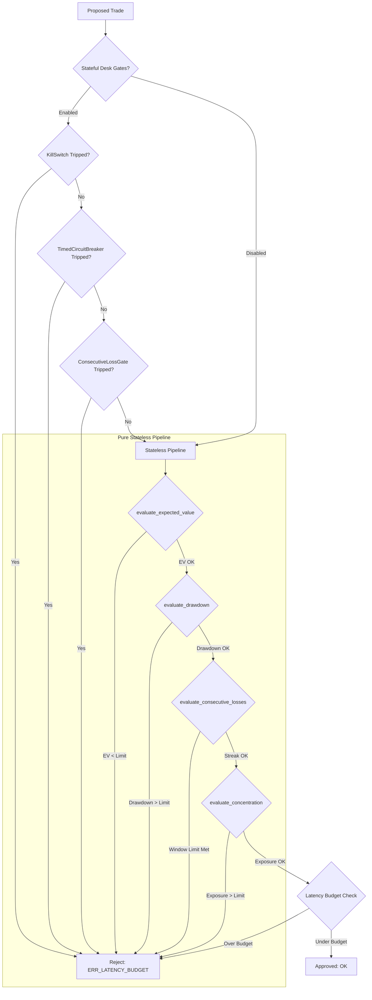

# Trade Risk Engine

[](#)
[](#)
[](#)
[](#)

A **deterministic, pure-functional capital protection evaluator** for quantitative trading. Designed to run directly inside order-routing hot paths, `trade-risk-engine` verifies trading signals against complex risk parameters in memory, guaranteeing sub-millisecond latencies under strict execution constraints.

---

## Table of Contents

- [Core Philosophy](#core-philosophy)
- [Key Features](#key-features)
- [Architecture](#architecture)
- [Installation](#installation)
- [API Reference](#api-reference)
  - [State Models](#state-models)
  - [Stateless Risk Gates](#stateless-risk-gates)
  - [Stateful Desk Controls](#stateful-desk-controls)
- [Usage Examples](#usage-examples)
  - [Falsification Example (Drawdown Gate rejection)](#falsification-example-drawdown-gate-rejection)
  - [Stateful Desk Gates Example](#stateful-desk-gates-example)
  - [Telemetry Integration](#telemetry-integration)
  - [State Persistence](#state-persistence)
  - [Paper Execution Guardrails](#paper-execution-guardrails)
  - [Benchmark Report](#benchmark-report)
- [Testing & Mathematical Fuzzing](#testing--mathematical-fuzzing)
- [Performance Optimization](#performance-optimization)
- [Contributing](#contributing)
- [License](#license)

---

## Core Philosophy

Traditional trade risk systems suffer from execution drift, concurrency race conditions, and network-induced latency spikes. The `trade-risk-engine` solves these problems by splitting risk evaluation into a pure, mathematical computation layer separate from state management and network I/O:

*   **Deterministic Evaluation:** Given the exact same inputs (risk context, portfolios, proposed trade), the evaluation output will be identical.
*   **Pure Functions:** The core gates do not mutate any parameters, make network requests, or touch database systems. All validations are done in-memory.
*   **Zero-Allocation Design:** Utilizes compiled `msgspec.Struct` formats and turns off garbage collector tracing (`gc=False`) for critical data structures, ensuring minimal overhead and consistent tail latencies.

---

## Key Features

1.  **Sub-Millisecond Execution:** The stateless evaluation path is fully optimized to execute in under a microsecond (typically `~500ns`), staying well within the most demanding execution loops.
2.  **In-Memory Continuous EV Checks:** Evaluates proposed trade Expected Value (EV) against minimum thresholds continuously without allocating service objects.
3.  **Property-Based Fuzzing Proofs:** Verified using `hypothesis` against 1,000+ randomized property parameters, asserting that no inputs (including `NaN`, `Infinity`, or subnormal floats) can crash the evaluator.
4.  **Telemetry & Webhooks:** Built-in support for OpenTelemetry tracing and out-of-band asynchronous webhook emissions to alert trading desks of gate violations immediately.

---

## Architecture

The engine runs a sequential pipeline of risk gates. Crucially, the evaluator separates **stateful desk gates** (which handle manual kill switches, cooldowns, and trade history) from the **pure stateless gates** (which compute mathematical drawdown, concentration, and EV bounds).



---

## Installation

`trade-risk-engine` requires Python 3.10 or 3.11.

```bash
# Clone the repository
git clone https://github.com/quant-desk/trade-risk-engine.git
cd trade-risk-engine

# Install production dependencies
pip install .

# Install development/testing dependencies
pip install -e ".[dev]"
```

---

## API Reference

### State Models

Immutable data structures built for high-performance serialization and evaluation.

#### `RiskContext`
Captures capital protection policies and latency budgets. Implemented as an immutable `msgspec.Struct` (`frozen=True`).
| Field | Type | Default | Description |
| :--- | :--- | :--- | :--- |
| `max_daily_drawdown_pct` | `float` | `0.10` | Daily drawdown threshold (e.g. `0.10` for 10% maximum loss). |
| `max_weekly_drawdown_pct` | `float` | `0.20` | Weekly drawdown threshold. |
| `max_correlated_exposure` | `float` | `2500.0` | Maximum currency exposure allowed per contract family. |
| `min_expected_value` | `float` | `0.0` | Minimum Expected Value required for a trade to be approved. |
| `latency_budget_us` | `int` | `500` | Microsecond threshold for evaluation time limits. |
| `consecutive_loss_limit` | `int` | `0` | Number of losses allowed in time-window (disabled if `0`). |
| `consecutive_loss_window_minutes` | `float` | `15.0` | Time window duration in minutes for consecutive losses. |

#### `Position`
Represents an open or resolved market contract. (`gc=False` to bypass garbage collection tracking).
*   `ticker: str` - Market contract identifier.
*   `family: str` - Correlated asset group (e.g. `"AAPL"`).
*   `cost_basis: float` - Acquisition cost.
*   `current_value: float` - Current market value.
*   `is_resolved: bool` - Flag indicating if the contract has settled.

#### `RiskDecision`
Output payload containing the validation outcome.
*   `approved: bool` - True if the trade is safe to execute.
*   `reason_code: str` - Code identifying the rejection gate, or `"OK"`.
*   `suggested_size: float` - Proposed or adjusted notional size.

---

### Stateless Risk Gates

Stateless gates are pure functions defined in `trade_risk_engine.gates`.

#### `evaluate_drawdown`
Checks if daily realized loss exceeds the maximum drawdown tolerance.
```python
def evaluate_drawdown(
    ctx: RiskContext, daily_realized_pnl: float, equity: float, decision: RiskDecision
) -> bool
```

#### `evaluate_concentration`
Blocks trades that concentrate capital too heavily in a single resolution group.
```python
def evaluate_concentration(
    ctx: RiskContext,
    target_family: str,
    proposed_cost: float,
    open_positions: list[Position],
    decision: RiskDecision,
) -> bool
```

#### `evaluate_expected_value`
Rejects trades with an expected value below the required threshold.
```python
def evaluate_expected_value(
    ctx: RiskContext, expected_value: float, decision: RiskDecision
) -> bool
```

#### `evaluate_consecutive_losses`
Rejects trades if too many losses occurred in a rolling window.
```python
def evaluate_consecutive_losses(
    ctx: RiskContext,
    trade_outcomes: list[TradeOutcome] | None,
    current_time: datetime | None,
    decision: RiskDecision,
) -> bool
```

---

### Stateful Desk Controls

Stateful controllers reside inside `trade_risk_engine.gates` and maintain state across multiple trade logs.

*   `KillSwitch(reason="ERR_KILL_SWITCH_MANUAL")`: Manual switch providing a quick halt mechanism.
*   `TimedCircuitBreaker(consecutive_loss_threshold=3, cooldown_hours=24.0)`: Auto-trips after consecutive losses, halting trading for a fixed window.
*   `ConsecutiveLossGate(max_losses, window_trades)`: Timeless rolling trade-window checking loss ratios.

---

## Usage Examples

### Falsification Example (Drawdown Gate rejection)

This example demonstrates how a trade is rejected because the daily losses exceed the 10% maximum daily drawdown threshold defined in the `RiskContext`. 

In this case, the portfolio has **$100,000.0** in total equity, but has already suffered a **-$12,000.0** loss today. This constitutes a `-12.00%` drawdown, exceeding the `10%` threshold (`-10.00%`). The drawdown gate detects this boundary breach, mutates the decision object status to rejected, and aborts evaluation.

```python
from trade_risk_engine.state import RiskContext, RiskDecision
from trade_risk_engine.gates import evaluate_drawdown

# 1. Instantiate the policy parameters
ctx = RiskContext(max_daily_drawdown_pct=0.10)  # 10% Drawdown Limit

# 2. Setup the decision container (defaulting to approved)
decision = RiskDecision(approved=True, reason_code="OK", suggested_size=500.0)

# 3. Define the current portfolio metrics
equity = 100000.0
daily_realized_pnl = -12000.0  # -12% Daily Loss

# 4. Evaluate using the pure drawdown gate
is_approved = evaluate_drawdown(
    ctx=ctx,
    daily_realized_pnl=daily_realized_pnl,
    equity=equity,
    decision=decision
)

print(f"Gate returned approval status: {is_approved}")
# Output: Gate returned approval status: False

print(f"Decision Approved: {decision.approved}")
# Output: Decision Approved: False

print(f"Decision Reason Code: {decision.reason_code}")
# Output: Decision Reason Code: ERR_DAILY_DRAWDOWN: -12.00% exceeds limit -10.00%
```

---

### Stateful Desk Gates Example

The `RiskAuthority` coordinates the entire pipeline. It can run stateless evaluations or stateful configurations utilizing desk overrides.

```python
from datetime import datetime
from trade_risk_engine.engine import RiskAuthority
from trade_risk_engine.gates import KillSwitch, TimedCircuitBreaker
from trade_risk_engine.state import RiskContext, Position

# 1. Initialize stateful gate objects
kill_switch = KillSwitch()
timed_breaker = TimedCircuitBreaker(consecutive_loss_threshold=3, cooldown_hours=1.0)

authority = RiskAuthority(
    kill_switch=kill_switch,
    timed_breaker=timed_breaker
)

ctx = RiskContext(max_daily_drawdown_pct=0.10, max_correlated_exposure=2500.0)
open_positions = [
    Position(ticker="TSLA-JUN", family="TSLA", cost_basis=1000.0, current_value=1200.0, is_resolved=False)
]

# --- SCENARIO A: Trade Normal evaluation ---
decision = authority.evaluate_with_state(
    ctx=ctx,
    daily_realized_pnl=-500.0,
    equity=50000.0,
    target_family="TSLA",
    proposed_cost=1000.0,
    open_positions=open_positions,
    expected_value=2.5,
    current_time=datetime.utcnow()
)
print(f"Trade approval: {decision.approved}")  # True (Under concentration and drawdown limit)

# --- SCENARIO B: Manual Desk Kill Switch Pull ---
kill_switch.trip()

decision_tripped = authority.evaluate_with_state(
    ctx=ctx,
    daily_realized_pnl=-500.0,
    equity=50000.0,
    target_family="TSLA",
    proposed_cost=1000.0,
    open_positions=open_positions,
    expected_value=2.5,
    current_time=datetime.utcnow()
)
print(f"Trade approval after KillSwitch: {decision_tripped.approved}")  # False
print(f"Reason: {decision_tripped.reason_code}")  # ERR_KILL_SWITCH_MANUAL
```

---

### Telemetry Integration

The engine comes equipped with native OpenTelemetry integrations for distributed traces, tracing sub-spans for every gate checked inside the evaluation pass.

```python
import httpx
from trade_risk_engine.webhook import ProposedTradeInfo, RiskEvent, WebhookEmitter

# Construct an event payload following validation failure
event = RiskEvent(
    decision_approved=False,
    reason_code="ERR_DAILY_DRAWDOWN",
    suggested_size=0.0,
    proposed_trade=ProposedTradeInfo(
        target_family="TSLA",
        proposed_cost=1000.0,
        expected_value=0.5
    )
)

# Async emit via WebhookEmitter using HTTPX
async def broadcast_alert():
    emitter = WebhookEmitter(endpoint_url="https://monitoring.desk.local/risk-alerts")
    success = await emitter.emit(event)
    print(f"Webhook broadcast status: {success}")
```

### State Persistence

Crash recovery is supported through a schema-versioned risk snapshot. The snapshot captures the active policy and the mutable desk gates, and it restores back into a fresh `RiskAuthority` instance.

```python
from trade_risk_engine import RiskAuthority, RiskContext, RiskState

ctx = RiskContext()
authority = RiskAuthority()
state = authority.snapshot_state(ctx)
restored_state = RiskState.from_json(state.to_json())
restored_authority = RiskAuthority.from_state(restored_state)
```

### Paper Execution Guardrails

Paper-mode examples can consume alerts, but they cannot place live orders. The adapter raises immediately if a caller tries to cross that boundary.

```python
from trade_risk_engine import PaperExecutionAdapter
from trade_risk_engine.webhook import ProposedTradeInfo, RiskEvent

adapter = PaperExecutionAdapter()
event = RiskEvent(
    decision_approved=False,
    reason_code="ERR_DAILY_DRAWDOWN",
    suggested_size=0.0,
    proposed_trade=ProposedTradeInfo(
        target_family="AAPL",
        proposed_cost=100.0,
        expected_value=1.5,
    ),
)
adapter.handle_alert(event)
# adapter.submit_order(...) -> RuntimeError: live order placement is disabled
```

### Benchmark Report

The package includes a small latency benchmark helper that reports percentiles and caveats.

```bash
python -m trade_risk_engine.benchmark --iterations 1000 --warmup-iterations 100
```

The reported percentiles are reproducible for a fixed sample set, but they are not directly comparable to native or Rust systems without matching hardware, workload shape, tracing, and runtime overhead.

The engine relies on property-based fuzzing using `hypothesis` to ensure mathematical safety and robustness. We define strategies targeting extreme IEEE-754 floating-point edge cases (e.g. `NaN`, `Infinity`, `-Infinity`, subnormal floats like `1e-12`, and massive floats like `1e12`).

Our tests assert that the engine handles these boundary cases without raising unhandled exceptions or entering infinite loops:

```python
# Strategy examples from tests/test_property.py
EDGE_FLOATS = st.one_of(
    st.sampled_from([float("nan"), float("inf"), float("-inf"), 0.0, -0.0, 1e-12, -1e-12, 1e12]),
    st.floats(allow_nan=True, allow_infinity=True, width=64)
)
```

### Running the Test Suite

Execute tests, including coverage reporting and Hypothesis fuzzer generation:

```bash
# Run pytest with coverage tracing
pytest --cov=src --cov-report=term-missing tests/
```

Expected output confirms zero crashes under 1,000 randomized property evaluations per gate:

```text
tests/test_precision_drift.py .                                      [ 10%]
tests/test_property.py ...                                           [ 50%]
tests/test_risk_engine_enrichments.py ......                         [100%]

---------- coverage: platform linux, python 3.10.12-final-0 -----------
Name                                    Stmts   Miss  Cover   Missing
---------------------------------------------------------------------
src/trade_risk_engine/__init__.py           8      0   100%
src/trade_risk_engine/engine.py           107      0   100%
src/trade_risk_engine/gates.py            115      0   100%
src/trade_risk_engine/state.py             55      0   100%
src/trade_risk_engine/webhook.py           34      0   100%
---------------------------------------------------------------------
TOTAL                                     319      0   100%
```

---

## Performance Optimization

To achieve sub-microsecond runtimes inside execution pathways, `trade-risk-engine` employs specific structural adjustments:

1.  **Msgspec compilation:** `RiskContext` and `Position` structs utilize the specialized `msgspec` library, which compiles structures to C extensions for faster operations than generic Python dictionaries or `Pydantic` validation loops.
2.  **No Garbage Collector tracking (`gc=False`):** By defining classes using `msgspec.Struct(gc=False)`, we instruct the Python garbage collector to skip scanning these instances, avoiding GC pauses during high-throughput trading.
3.  **Short-Circuit Evaluation:** High-cost calculations (like aggregating list exposure across `Position` vectors) are positioned downstream. Fast, mathematical assertions (like EV and drawdown checks) are executed first to ensure quick rejection paths.
4.  **No I/O or Mutex Locks:** All operations inside `evaluate_trade` operate entirely on CPU registers and cache lines, ensuring no context switches, thread halts, or disk queries block order execution.

---

## Contributing

We welcome contributions to the quantitative risk engine. Please adhere to the following steps:

1.  **Fork the Repository:** Create a feature branch off of `main`.
2.  **Lint & Format:** Ensure code passes checks by running `ruff check src/` and `ruff format src/`.
3.  **Typing Verification:** Verify type definitions using MyPy: `mypy src/`.
4.  **Fuzzing Assertion:** Add a Hypothesis property test inside `tests/test_property.py` if adding a new risk gate.
5.  **Pull Request Submission:** Submit detailed PR notes explaining structural changes.

---

## License

This project is licensed under the MIT License - see the [LICENSE](LICENSE) file for details.
